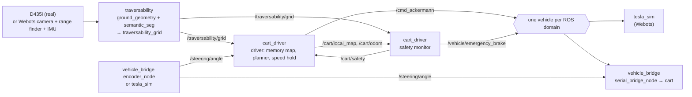

# BITSAuto system map

> This page is identical in every BITSAuto repository we maintain. If you
> change it, change it everywhere (see [the update rules](../README.md#how-to-keep-this-book-current)).

The BITSAuto cart is a campus golf cart with drive-by-wire throttle, brake and
a relay-driven steering motor. An Intel RealSense D435i looks ahead, an Nvidia
Jetson Orin AGX runs the software, and a Webots simulation stands in for the
cart when nobody can be on campus. Four repositories make up the current
stack.

## The repositories

| Repo | Visibility | What it is | Runs on |
| --- | --- | --- | --- |
| [`tesla_sim`](https://github.com/BITSAuto/tesla_sim) | public | Webots "digital clone": a Tesla Model 3 body with the cart's sensors, steering relay, coast-only speed and emergency brake | laptop (ROS 2 Humble in a distrobox) or Ubuntu 24.04 / Jazzy |
| [`vehicle_bridge`](https://github.com/BITSAuto/vehicle_bridge) | public | Real-cart I/O: `/cmd_ackermann` → serial drive-by-wire, the steering encoder node, and the relay steering controller that `tesla_sim` also imports | Orin (Jazzy) |
| [`traversability`](https://github.com/BITSAuto/traversability) | public | Perception: depth ground-plane geometry fused with semantic segmentation into an occupancy grid; training pipeline and TensorRT deployment | Orin (TensorRT) and laptop (torch) |
| [`cart_driver`](https://github.com/BITSAuto/cart_driver) | private | Driving: 5 km/h throttle-only speed hold, an independent safety monitor (the only thing that may brake), a short-term memory map, an arc planner and loop-route following | laptop (sim) today; Orin later |

Not ours, used as reference only: `road_segmentation` (the YOLO road model
this work replaces; **do not modify it**), `cart_contorller` (older controller
with CARLA code; the source of the real steering timing constants).

## How data flows

## Rules every repo follows

These come from the cart's hardware and from explicit team decisions. Don't
break them without a new decision record in the repo that changes them.

1. **The brake is for emergencies only.** The cart's brake cannot modulate: it
   stops the cart instantly and can damage it. Normal driving slows by
   releasing throttle and **coasting**. Only `cart_driver`'s safety monitor
   publishes `/vehicle/emergency_brake`.
2. **Fixed cruise of 5 km/h**, slow enough that every turn is possible.
3. **Steering sign: positive = RIGHT** on `/cmd_ackermann.steering_angle` and
   `/steering/angle`. This is the opposite of ROS REP 103. The IMU yaw rate is
   standard (counter-clockwise positive).
4. **Steering is a relay**, not a servo: about 12.86 °/s, limited to ±15°.
   Plans must allow for how long the wheels take to turn.
5. **`/cmd_ackermann.speed` is in km/h** and `steering_angle` is in radians.
6. **One vehicle per ROS domain.** `tesla_sim` and the real cart publish the
   same topics (`/steering/angle`, `/vehicle/emergency_brake`, ...). Never run
   both on one `ROS_DOMAIN_ID`.
7. **Simulation testing happens in Webots** via `run_tesla_sim.sh`. CARLA is
   not used.

## Shared topic contract

| Topic | Type | Publisher | Subscribers | Notes |
| --- | --- | --- | --- | --- |
| `/cmd_ackermann` | `ackermann_msgs/AckermannDrive` | cart_driver `driver` | tesla_sim, vehicle_bridge | speed km/h (0 = coast), steering rad, + = right |
| `/vehicle/emergency_brake` | `std_msgs/Bool` | cart_driver `safety` | tesla_sim, vehicle_bridge | `true` = instant stop, held until `false` |
| `/steering/angle` | `std_msgs/Float32` | vehicle_bridge `encoder_node` / tesla_sim | cart_driver, vehicle_bridge | degrees, + = right |
| `/vehicle/speed` | `std_msgs/Float32` | tesla_sim only | cart_driver | m/s. **No real-cart publisher yet** |
| `/bitsauto/speed` | `std_msgs/Float32` | tesla_sim only | legacy scripts | km/h. No real-cart publisher yet |
| `/vehicle/imu` | `sensor_msgs/Imu` | tesla_sim (real: RealSense IMU topics) | traversability, cart_driver | orientation is never filled in |
| `/vehicle/gps` | `geometry_msgs/PointStamped` | tesla_sim only | cart_driver (route) | world-frame position of the front bumper |
| `/traversability/grid` | `nav_msgs/OccupancyGrid` | traversability | cart_driver | frame `camera_ground`; 0 free, 100 lethal, -1 unknown |

## Where to read more

Each repository has its own `project-docs/` book with the same chapters.
Start at its `project-docs/README.md`. Facts about the real cart's hardware
live in `vehicle_bridge`; facts about Webots live in `tesla_sim`; perception
in `traversability`; driving in `cart_driver`.
