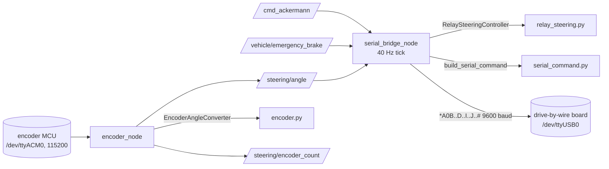

# Components

| File | Role |
| --- | --- |
| `vehicle_bridge/serial_command.py` | `build_serial_command(...)`: the wire format, single source of truth; `SERIAL_BAUD = 9600`, `THROTTLE_NEUTRAL = 50` |
| `vehicle_bridge/relay_steering.py` | `RelaySteeringController` and the timing constants (`MIN_HOLD_S`, `DEG_PER_MIN_HOLD`, `RATE_DEG_S`, thresholds). Imported by tesla_sim |
| `vehicle_bridge/serial_bridge_node.py` | The bridge node: subscriptions, throttle mapping, control tick, serial I/O, shutdown command |
| `vehicle_bridge/encoder.py` | `EncoderAngleConverter`: parse a line, apply zero, scale, invert and offset. No ROS or serial dependency |
| `vehicle_bridge/encoder_node.py` | Opens the encoder MCU's port, reconnects every second, zeroes, publishes angle and count, `~/zero` service |
| `config/encoder.yaml` | Encoder calibration (`degrees_per_count`, `invert`, `offset_deg`) |
| `launch/vehicle_bridge.launch.py` | Starts both nodes and loads `config/encoder.yaml` |

There are no unit tests yet ([09-testing-and-results/unit-tests.md](../09-testing-and-results/unit-tests.md)).
