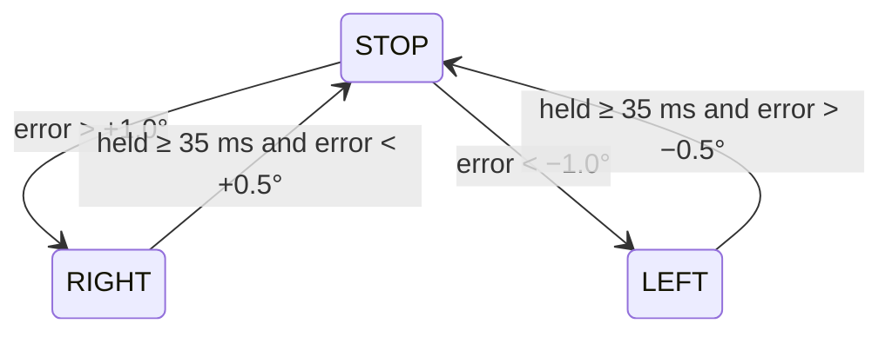

# Relay steering controller

`RelaySteeringController.update(target_deg, encoder_deg, now_s) -> relay`,
called once per control tick.

- `error = target − encoder`; + = right.
- **Minimum hold 35 ms** once a pulse starts (the motor reacts in about
  30 ms); starting a pulse has no wait.
- **No direct reversal.** LEFT ↔ RIGHT always passes through STOP, a
  safety property carried over from the legacy `rotary_encoder_driver.py`.
- **Hysteresis:** start at 1.0°, stop below 0.5°. The low threshold must not
  be smaller than one pulse's motion (~0.45°) or it overshoots every time.
- `RATE_DEG_S = 0.45 / 0.035 ≈ 12.86 °/s`: how fast the wheels turn while the
  relay is on. tesla_sim uses this to move its simulated rack.
- `reset()` returns to STOP (used when the angle goes stale).

**Shared with tesla_sim.** tesla_sim's driver imports this class and feeds it
the simulated rack angle, so the sim's steering step response is the cart's
by construction. Changing thresholds or timing here changes both. Don't tune
sim-only behaviour into it.
